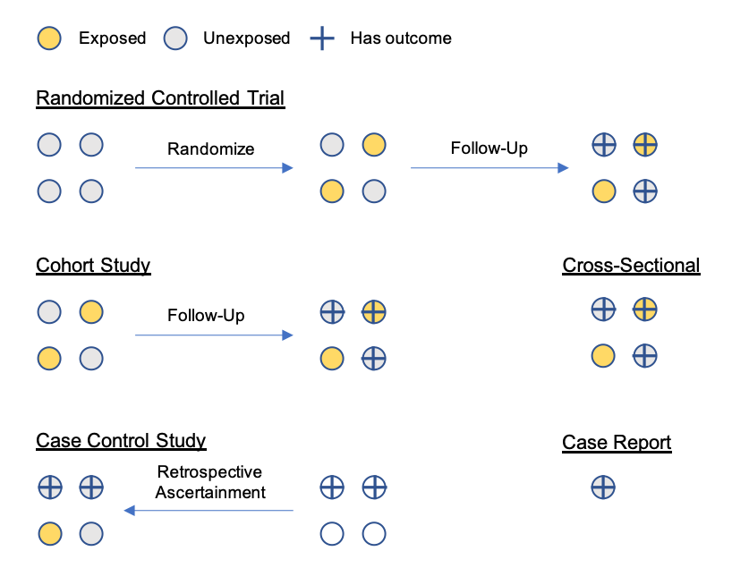

```{r setup, include=FALSE}
knitr::opts_chunk$set(echo = FALSE)
library(beeswarm)
library(knitr)
library(kableExtra)
beeswarm_sim <- function(n, mean1, mean2, add_means=FALSE, add_beeswarm=TRUE){
  group_1 <- rnorm(n, mean=mean1)
  group_2 <- rnorm(n, mean=mean2)
  df <- data.frame(
    group=c(rep("group_1", n), rep("group_2", n)),
    mean=c(group_1, group_2)
  )
  if(add_beeswarm){
    beeswarm(mean ~ group, data=df, col=c("purple", "gold"), pch=16)
  }
  if(add_means){
    boxplot(mean ~ group, data=df, add=add_beeswarm, col="#0000ff22")
  }
}
```

## Goal

Introduce you to epidemiological thinking and key (bio)statistical concepts that you can use to critically interpret scientific studies in health and medicine.

## Learning Objectives I.

1. **Basics**. Identify key elements of an epidemiological study and how they relate to the scientific question
2. **Study Design**. Recognize the basic types of epidemiological study design and identify when each design is appropriate for the scientific question
3. **Bias**. Recognize sources of bias in study designs or measurements and understand how they might affect your ability to answer the scientific question

## Learning Objectives II.

4. **Modeling**. Understand how you can formulate your understanding about a data generating process, assumptions, and a hypothesis to test in a statistical model
5. **Inference**. Recognize the distinction between an effect size, a confidence interval, and a p-value as they relate to parameters that are estimated in a statistical model

## Basics

A epidemiological study should be generated by a *scientific question of interest*. Broadly, you can think of these scientific questions falling into two main categories:

- **Descriptive**: What is the incidence rate of ischemic stroke (IS) in women aged 45 - 60 years old?
- **Inferential**: What is the effect of an experimental treatment on mortality following ischemic stroke in women aged 45 - 60?

From a statistical point of view it is not a clean distinction because you still use statistical tools to _infer_ the incidence rate for a descriptive study.

## Basics

The questions _who, what, where, when_ have never been more important than in the context of epidemiology!

Having a well-defined scientific question means having clear answers for the following components:

- **Exposure**: What is the group in study exposed to that you want to measure the effect of, and over what period of time?
- **Population**: Who is the group being studied?
- **Outcome**: What outcome is being studied (either in relation to the exposure or on its own) and over what period of time?

The _why_ is also important! Epidemiological studies should serve some purpose.

## Basics: Measures

Once you've defined your target exposure, outcome, and population that makes up your scientific questions, understanding **measurement** of the outcomes is of utmost importance.

Some common outcome measurements in the context of health sciences are

- **prevalence**: proportion of a population with an outcome
- **incidence**: rate of getting the outcome among individuals in a population that did not already have the outcome ("risk")
- **remission**: rate of returning to be outcome-free among those that had the outcome

Think about denominators!

## Basics

What are the exposure, outcome, and population for each of these scientific questions?

- **Descriptive**: What is the incidence rate of ischemic stroke (IS) in women age 45 - 60 years old?
- **Inferential**: What is the effect of an experimental treatment on mortality following ischemic stroke in women age 45 - 60?

```{r table, echo=FALSE, message=FALSE, warnings=FALSE, results='asis'}
df <- data.frame(Type = c("Exposure", "Outcome", "Population"), 
                 Descriptive = linebreak(c(" ", " ", " ")), 
                 Inferential = linebreak(c(" ", " ", " ")))
kable(df, col.names = c("", "Descriptive", "Inferential"), escape = F, caption = "Basic Elements of Study Design") %>%
  kable_styling(latex_options = "hold_position")
```

## Basics

What are the exposure, outcome, and population for each of these scientific questions?

- **Descriptive**: What is the incidence rate of ischemic stroke (IS) in women age 45 - 60 years old?
- **Inferential**: What is the effect of an experimental treatment on mortality following ischemic stroke in women age 45 - 60?

```{r table2, echo=FALSE, message=FALSE, warnings=FALSE, results='asis'}
df <- data.frame(Type = c("Exposure", "Outcome", "Population"), 
                 Descriptive = linebreak(c(" ", "ischemic stroke (IS)", "women age 45-60 without IS")), 
                 Inferential = linebreak(c("experimental treatment", "death from IS", "women age 45-60 with IS")))
kable(df, col.names = c("", "Descriptive", "Inferential"), escape = F) %>%
  kable_styling(latex_options = "hold_position")
```

How would you make these questions more precise?

## Study Design

With a binary exposure and a binary outcome, the results of a study will look something like this 2x2 table:

```{r table3, echo=FALSE, message=FALSE, warnings=FALSE, results='asis'}
df <- data.frame(Exposure = c("Exposed", "Unexposed"), 
                 Outcome = linebreak(c("a", "b")), 
                 NoOutcome = linebreak(c("c", "d")))
kable(df, col.names = c("", "Outcome", "No Outcome"), escape = F,
      caption="Example 2x2 Table") %>%
  kable_styling(latex_options = "hold_position")
```


But there are _so many ways_ to obtain that 2x2 table, so it is imperative to understand the study design behind the data!

Understanding study design will make it clear **what are the valid analyses** that can be performed on the data in that table.

## Study Design

Starting with what is typically considered the studies that will provide the "strongest" evidence of a _causal_ relationship between an exposure and an outcome:

- **Randomized controlled trials**: participants are _randomly_ assigned to an exposure treatment or a control and followed up over time to record outcomes
- **Cohort studies**: participants are selected based on their exposure status and followed up to record outcomes
- **Case control studies**: participants are selected based on their outcome status and we inquire about exposure in the past
- **Cross-sectional studies**: measure exposure and outcome of participants at the same point in time (no temporal element)
- **Case reports**: report on the outcome status of one or a handful of interesting cases

## Study Design



## Biases

Biases in the epidemiological context are any factors in your study that _prevent_ you from being able to answer your precise scientific question.

Biases may result from systematically incorrect measurements of the outcome, the exposure, or the population.

Some study designs may avoid certain types of bias, but it is crucial to always be on the lookout for sneaky biases when designing, analyzing, or reading a study.

## Biases

Examples of biases include:

- **Selection bias**: the population that you want to study is not the population that is actually in your study
- **Confounding bias**: the relationship between exposure and outcome among those in your study is _confounded_ by other variables (more later)
- **Recall bias**: individuals are being asked about exposures or outcomes that they do not remember correctly
- **Social desirability bias**: individuals are not comfortable disclosing their true exposure or outcome status for fear of judgement by others

This is by no means an exhaustive list. See [a catalogue of bias](https://catalogofbias.org/biases/) for a taxonomy and more examples.

## Biases & Study Design

- Randomized controlled trials are designed to _eliminate bias_: statistically speaking, we do not expect there to be significant differences in the characteristics of the treatment groups
- Observational study designs like cohort studies and case control studies _observe_ what's already happening -- what if those that are exposed also have characteristics that make it more likely that they will have the outcome (**confounding**: more later)?
- Studies that rely on participants to self-ascertain, or to recall things from the past (e.g. case control studies) may result in systematic measurement error of exposure or outcome

## Selection Bias

Recall our example inferential question: **What is the effect of an experimental treatment on mortality following ischemic stroke in women age 45 - 60?**

Consider the following sampling strategies:

- Sample women aged 45 - 60 who have been discharged from the hospital following ischemic stroke, randomly assign some to experimental treatment.
- Sample women aged 45 - 60 who have been admitted to the hospital for ischemic stroke, randomly assign some to experimental treatment.

Which may suffer from selection bias? 

## Confounding

Again, recall our example inferential question: **What is the effect of an experimental treatment on mortality following ischemic stroke in women age 45 - 60?**

What if we do not assign the experimental treatment, but the physician decides whether or not to administer treatment to the patient?

For a gentle introduction to similar problems and techniques that control for such problems in observational study designs, check out [The Book of Why](http://bayes.cs.ucla.edu/WHY/) by Judea Pearl.

## Inference: Simple Means

```{r}
set.seed(0)
beeswarm_sim(n=10, mean1=2.0, mean2=2.5)
```

## Inference: Simple Means

```{r}
set.seed(0)
beeswarm_sim(n=10, mean1=2.0, mean2=2.5, add_means=TRUE)
```

## Inference: Small Effect Size, Small Sample Size

```{r}
set.seed(0)
par(mfrow=c(2, 2))
for(i in 1:4){
  beeswarm_sim(n=10, mean1=2.0, mean2=2.5, add_means=TRUE)
}
```

## Inference: Large Effect Size, Small Sample Size

```{r}
set.seed(0)
par(mfrow=c(2, 2))
for(i in 1:4){
  beeswarm_sim(n=10, mean1=2., mean2=10., add_means=TRUE)
}
```

## Inference: Small Effect Size, Large Sample Size

```{r}
set.seed(0)
par(mfrow=c(2, 2))
for(i in 1:4){
  beeswarm_sim(n=100000, mean1=2.0, mean2=2.5, add_means=TRUE, add_beeswarm=FALSE)
}
```
