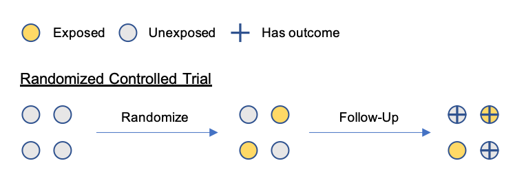

```{r setup, include=FALSE}
knitr::opts_chunk$set(echo = FALSE)
library(beeswarm)
library(knitr)
library(kableExtra)
beeswarm_sim <- function(n, mean1, mean2, add_means=TRUE, add_beeswarm=TRUE, ...){
  group_1 <- rnorm(n, mean=mean1)
  group_2 <- rnorm(n, mean=mean2)
  df <- data.frame(
    group=c(rep("control", n), rep("treatment", n)),
    y=c(group_1, group_2)
  )
  test <- t.test(group_1, group_2)
  if(add_means){
    boxplot(y ~ group, data=df, col="#0000ff22", cex=2, ..., xlab=paste0("p-value: ", round(test$p.value, 4)), outline=FALSE)
  }
  if(add_beeswarm){
    beeswarm(y ~ group, data=df, add=add_beeswarm, col=c("purple", "gold"), pch=16, cex=2, ..., xlab=paste0("p-value: ", round(test$p.value, 4)))
  }
}
```

## Goal

Introduce you to epidemiological thinking and key (bio)statistical concepts that you can use to critically interpret scientific studies in health and medicine.

## Learning Objectives (1/2)

1. **Basics**. Identify key elements of an epidemiological study and how they relate to the scientific question
2. **Study Design**. Recognize the basic types of epidemiological study design and identify when each design is appropriate for the scientific question
3. **Bias**. Recognize sources of bias in study designs or measurements and understand how they might affect your ability to answer the scientific question

## Learning Objectives (2/2)

4. **Modeling**. Understand how you can formulate your understanding about a data generating process, assumptions, and a hypothesis to test in a statistical model
5. **Inference**. Recognize the distinction between an effect size, a confidence interval, and a p-value as they relate to parameters that are estimated in a statistical model

TODO -- talk about $\beta$ inference in the example

## Further Study

This lecture and follow-up discussion will be a very brief introduction, with some material borrowed from the following texts. These are good introduction texts to epidemiology and biostatistics:

{width=30%} {width=30%}

## Basics

A epidemiological study should be generated by a *scientific question of interest*. Broadly, you can think of these scientific questions falling into two main categories:

- **Descriptive**: What is the incidence rate of ischemic stroke (IS) in women aged 45 - 60 years old?
- **Inferential**: What is the effect of an experimental treatment on mortality following ischemic stroke in women aged 45 - 60?

From a statistical point of view it is not a clean distinction because you still use statistical tools to _infer_ the incidence rate for a descriptive study.

## Basics: Terminology

The questions _who, what, where, when_ have never been more important than in the context of epidemiology!

Having a well-defined scientific question means having clear answers for the following components:

- **population**: Who is the group being studied? Study populations should be representative of the target population that the study results will be generalized to.
- **exposure**: What is the group in study exposed to that you want to measure the effect of, and over what period of time?
- **outcome**: What outcome is being studied (either in relation to the exposure or on its own) and over what period of time?

## Basics: Measures

Once you've defined your target exposure, outcome, and population that makes up your scientific questions, understanding **measurement** of the outcomes is of utmost importance.

Some common outcome measurements in the context of health sciences are

- **prevalence**: proportion of a population with an outcome
- **incidence**: rate of getting the outcome among individuals in a population that did not already have the outcome ("risk")
- **remission**: rate of returning to be outcome-free among those that had the outcome
- **odds**: $\frac{p}{1 - p}$ where $p$ is a proportion

_Think about denominators!_

A common measurement in clinical epidemiology is **survival**, or time to some endpoint. We do not have time to go into details, but I recommend [this source](https://www.nature.com/articles/6601118) as a starting point.

## Basics: Measures for Comparisons

Common measures of comparison between two exposure groups include functions of the measures we just discussed:

- **relative risk** or **risk difference**: comparing incidence of an outcome between two groups as a difference or a ratio
- **odds ratio**: comparing odds of an outcome between two groups as a ratio
- **hazard ratio**: compares the "hazard" of an outcome between two groups -- used commonly in survival analysis

## Basics: 2x2 Tables

With a binary exposure and a binary outcome, the results of a study will look something like this 2x2 table:

```{r table3, echo=FALSE, message=FALSE, warnings=FALSE, results='asis'}
df <- data.frame(Exposure = c("Exposed", "Unexposed"), 
                 Outcome = linebreak(c("a", "b")), 
                 NoOutcome = linebreak(c("c", "d")))
kable(df, col.names = c("", "Outcome", "No Outcome"), escape = F,
      caption="Example 2x2 Table") %>%
  kable_styling(latex_options = "hold_position")
```

But there are _so many ways_ to obtain that 2x2 table, so it is imperative to understand the study design behind the data!

Understanding study design will make it clear **what are the valid analyses** that can be performed on the data in that table.

## Basics: Example (1/2)

What are the exposure, outcome, and population for the following scientific question?

**What is the effect of an experimental treatment on mortality following ischemic stroke in women age 45 - 60?**

- Population:
- Exposure:
- Outcome:

## Basics: Example (2/2)

What are the exposure, outcome, and population for the following scientific question?

**What is the effect of an experimental treatment on mortality following ischemic stroke in women age 45 - 60?**

- Population: **women age 45-60 who have had ischemic stroke**
- Exposure: **experimental treatment**
- Outcome: **death from ischemic stroke**

How would you make these questions more precise?

## Study Design: Types

Starting with what is typically considered the studies that will provide the "strongest" evidence of a _causal_ relationship between an exposure and an outcome:

Experimental Designs

- Randomized controlled trials

Observational Designs

- Cohort studies
- Case control studies
- Cross-sectional studies
- Case reports

## Study Design: Randomized Controlled Trials

An experimental setting in which participants are enrolled and then _randomly_ assigned to a treatment or a control and followed up over time to record outcomes.

- Ideal for inferring causal relationships because there are no significant differences between treatment and control groups, both in terms of factors we can measure and factors we cannot measure (more later with confounding)
- They are expensive, time consuming, and not always feasible or ethical (think smoking)

{width=85%}

## Study Design: Cohort Study

An observational design where participants are selected based on their exposure status and followed up to record outcomes at designated time points.

- Similar to a randomized controlled trial with one key difference: the exposures are not randomized! You may only **observe what is already happening**.

{width=85%}

## Study Design: Case-Control Study

An observational design where participants are selected based on their outcome status and we inquire about exposure in the past. Think of it as the opposite of a cohort study, looking back in time.

- May be subject to biases like *recall bias* (more later)
- The artificial distribution of cases and controls means you cannot naively compute "prevalence" of the outcome or "relative risk"


## Study Design: Cross-Sectional Study

An observational design where you measure exposure and outcome of participants at the same point in time (no temporal element).


## Study Design: Case Report

An observational design where you report on the outcome status of one or a handful of interesting cases. "Anecdotal" evidence.


## Study Design: Example

Recall our example: **What is the effect of an experimental treatment on mortality following ischemic stroke in women age 45 - 60?**

Which of the following designs would you prefer to answer this scientific question and why?

- Randomized controlled trial
- Cohort study
- Case control study
- Cross-sectional
- Case report

## Biases: Taxonomy

Biases in the epidemiological context are any factors in your study that **prevent you from being able to answer your precise scientific question**.

Biases may result from systematically flawed measurements of the outcome, the exposure, or the population, categorized generally as:

- **\textcolor{red}{selection biases}**: biases that are a function of the sampling or selection of participants for the study -> cannot generalize to target population
- **\textcolor{blue}{information biases}**: biases that are a function of how the measurements on participants are taken

Some study designs may avoid certain types of bias, but it is crucial to always be on the lookout for sneaky biases when designing, analyzing, or reading a study.

## Biases: Examples

Examples of biases include:

- **\textcolor{red}{Loss to follow-up bias}**: participants leave the study in such a way that it distorts the relationship between the exposure and outcome
- **\textcolor{blue}{Confounding bias}**: the relationship between exposure and outcome among those in your study is _confounded_ by other variables (more later)
- **\textcolor{blue}{Recall bias}**: individuals are being asked about exposures or outcomes that they do not remember correctly
- **\textcolor{blue}{Social desirability bias}**: individuals are not comfortable disclosing their true exposure or outcome status for fear of judgement by others

This is by no means an exhaustive list. See [a catalogue of bias](https://catalogofbias.org/biases/) for a taxonomy and more examples.

## Biases: Selection Bias Diagram

An example of selection bias is loss to follow-up. Consider a situation where 

{width=75%}

## Biases: Selection Bias Example

Recall our example inferential question: **What is the effect of an experimental treatment on mortality following ischemic stroke in women age 45 - 60?**

Consider the following sampling strategies:

1. Sample women aged 45 - 60 who have been discharged from the hospital following ischemic stroke, randomly assign some to experimental treatment.
2. Sample women aged 45 - 60 who have been admitted to the hospital for ischemic stroke, randomly assign some to experimental treatment.

Which may suffer from selection bias? 

## Biases: Confounding Diagram

Confounding occurs when there is a third, measured or unmeasured, factor $Z$ that causes the exposure $X$ and is associated (perhaps causally) with the outcome $Y$. If $X \to Z$, then it is not a confounder because $Z$ is _in the causal pathway_ between $X$ and $Y$.


If we have **measured** $Z$, then there is hope that we can recover the true relationship between $X$ and $Y$. If $Z$ is unmeasured (which is often the case), it is much more difficult. In the case where $Z$ is measured, there are standard techniques to "control" for $Z$.

## Biases: Confounding Example

Again, recall our example inferential question: **What is the effect of an experimental treatment on mortality following ischemic stroke in women age 45 - 60?**

What if we do not assign the experimental treatment, but the physician decides whether or not to administer treatment to the patient?


## Biases: Confounding and Stratification (1/5)

Consider a study where we have an equal number of exposed and unexposed participants, and we want to follow them over time to observe an outcome.

{width=75%}

## Biases: Confounding and Stratification (2/5)

If you saw the result below, you would conclude that the exposure is protective: the proportion of participants with the outcome is much greater among the unexposed than the exposed.

Confounding occurs when there is a hidden (and hopefully measured!) factor, indicated by the red outline. The distribution of the hidden factor differs among the exposed and unexposed, and among those that have and don't have the outcome.

## Biases: Confounding and Stratification (3/5)

{width=75%}

## Biases: Confounding and Stratification (4/5)

{width=90%}

## Biases: Confounding and Stratification (5/5)

If we have measured the confounder, then we can do what is called a **stratified analysis**: look within the strata of the confounder and assess the relationship between exposure and outcome separately.

You can see that within a given strata, the proportion who have the outcome is identical among those exposed and unexposed. There is no relationship between exposure and outcome.

Although we did this with a **binary** exposure and outcome, similar techniques exist for a continuous exposure and outcome.

## Modeling: Intro

The basic motivation behind statistical modeling in epidemiology is that if you model the _data generating process_ with some unknown parameters, then you can use observed data to estimate the unknown parameters of the data generating process.

$$
Y = f(\theta)
$$

If we knew $\theta$, then it might be interesting to generate some $Y$'s. In fact, many mathematical modelers do this. But we are interested in the *inverse problem* -- given $Y$, then what was $\theta$?

_The assumptions that you made in your study design go into $f(\theta)$!_

## Modeling: Linear Models

For most applications in epidemiology, the function $f$ has some additional data that has been collected on individuals. Quite often, analyses use _linear models_, and find the "best fit" to the data.

$$
y = \alpha + \beta x
$$

```{r fig.height = 3, fig.width = 5}
x <- seq(0, 10, by=0.1)
y <- 2 + x * 1 + rnorm(length(x), sd=2)
plot(y ~ x, col='purple')
abline(a=2, b=1, col='black', lwd=2)
```

## Modeling: Generalized Linear Models

If you have data that looks like the previous plot with a continuous dependent variable, you're good to go with a basic linear regression.

Things get more complicated with different data types.

$$
g(y) = \alpha + \beta x
$$

```{r table2, echo=FALSE, message=FALSE, warnings=FALSE, results='asis'}
df <- data.frame(Data_Type = c("continuous", "counts", "binary"), 
                 Mean = linebreak(c("linear", "log-linear", "logistic-linear")),
                 Link = linebreak(c("g(y) = y",
                                    "g(y) = log(y)",
                                    "g(y) = logit(y)")),
                 Distribution = linebreak(c("Gaussian", "Poisson", "Bernoulli")),
                 Measure = linebreak(c("risk difference", "log risk ratio", "log odds ratio")))
kable(df, col.names = c("Data Type", "Mean", "Link Function", "Statistical Distribution", "Coefficients"), escape = F,
      caption="Common Mean Relationships and Distributions in Epidemiology") %>%
  kable_styling(latex_options = "hold_position", font_size=8) %>% row_spec(0,bold=TRUE)
```

## Modeling: Randomized Controlled Trial

Consider a **randomized controlled trial**. We have an independent variable $X$ that is $1$ when the participant was randomized to treatment and $0$ when they received placebo. The outcome $Y$ is continuous. We could ask,

- What is the mean $Y$ in the control group ($x = 0$)?
- What is the mean $Y$ in the treatment group ($x = 1$)?
- What is the _difference_ between the mean outcome $Y$ in treatment compared to control?

## Modeling: Linear Models

Thinking about both the **data generating process** and the **hypothesis that we want to answer**, we can parametrize a model.
$$
Mean[Y|X=x] = \alpha + \beta x
$$

- What is mean $Y$ among controls ($x = 0$)? $\to \alpha$
- What is mean $Y$ among treated ($x = 1$)? $\to \alpha + \beta$
- What is _difference_ between the mean outcome $Y$ in treatment compared to control? $\to \beta$

## Modeling: Visualization

```{r}
set.seed(0)
beeswarm_sim(n=50, mean1=2.0, mean2=6.0)
abline(2.0, 0, lty='dotted')
abline(6.0, 0, lty='dotted')
segments(x0=1.5, x1=1.5, y0=2.0, y1=6.0, lty='dotted')
text(x=0.5, y=2, expression(alpha))
text(x=1.45, y=4, expression(beta))
text(x=0.5, y=6, expression(alpha + beta))
```

## Modeling: Example (1/3)

Think back to our randomized controlled trial for women that have had a stroke, and let $Y$ be whether or not they died, and $X$ be their treatment group. We might start with the same linear model:

$$
Mean[Y|X] = \alpha + \beta X
$$

Do you see any problems with how this model is parametrized?

## Modeling: Example (2/3)

Think back to our randomized controlled trial for women that have had a stroke, and let $Y$ be whether or not they died, and $X$ be their treatment group. We might start with the same linear model:

$$
Mean[Y|X] = Proportion[Y|X] = \alpha + \beta X
$$
Do you see any problems with how this model is parametrized? **Yes! The mean can go beyond the [0, 1] range, which doesn't make sense for a proportion.**

## Modeling: Example (3/3)

From our example, it makes most sense to think of $Y$ as a flip of a loaded coin -- this is the Bernoulli distribution -- and how loaded the coin is depends on the group $X$.

$$
logit(Mean[Y|X]) = \alpha + \beta X \to Mean[Y|X] = \frac{e^{\alpha + \beta X}}{1 + e^{\alpha + \beta X}}
$$

This is called _logistic regression_. Now $\alpha + \beta x$ explicitly modify the probability of having the outcome $Y$, and it must stay between 0 and 1.

## Modeling: Notes

- I've only presented examples where the independent variables (or "covariates") are binary 0/1. The same methods can be used when the independent variable is continuous.
- What I've presented so far is considered _parametric_ modeling, and it is common in epidemiology. You may come across _semi-_ or _non-parametric_ modeling as you're reading literature. It is a way to make fewer assumptions about the data generating process, but will typically come with the tradeoff of increased variability in the result.

## Inference

How do we actually estimate $\theta$ in $Y = f(\theta)$? There are a variety of techniques depending on what $f$ is, but one thing is for certain -- **there will always be uncertainty**.

Inference is about making our **best guess** about $\theta$, and providing some degree of **confidence** in that guess (typically 95% confidence). This may also include a **p-value** for a hypothesis test.

Let's walk into these three elements in more detail -- (1) point estimates, (2) confidence intervals, and (3) p-values.

## Inference: Point Estimates

In order to make the "best guess" for the parameter we use information about the distribution that is specified (e.g. normal distribution) and combine all of the observations together to figure out what value of $\theta$ is the **most likely**.

The **most likely** value is reported as the **point estimate**.  
  
*"We estimate a risk ratio of **1.10**, meaning that there was a 10% increased risk of having the outcome in the exposed group compared to controls."*

## Inference: Confidence Intervals

Confidence intervals (typically 95%) represent the degree of uncertainty that we have in our point estimate.

The interpretation is a bit counter-intuitive: if this experiment were to be replicated 100 times, 95 of the confidence intervals constructed in these experiments would cover the **true parameter**.

*"We estimate a risk ratio of **1.10 (1.05 - 1.15)**, meaning that there was a 10% (5% - 15%) increased risk of having the outcome in the exposed group compared to controls."*

## Inference: P-Values

If we have some estimate of $\theta$, $\hat{\theta}$, p-values make sense in the context of a **hypothesis test**. It might look something like this:

$$
H_0: \theta = 0 \quad H_1: \theta \neq 0
$$

This means: my **null** hypothesis is that $\theta = 0$. In linear regression, if $\theta$ was the slope of the line, that means _there is no slope_ (or no association).

A **p-value** of 0.05 has the following interpretation: the chance of seeing a result this extreme or more extreme **if the null hypothesis were true** is 5%.

*"We estimate a risk ratio of **1.10** with a p-value of 0.02. If there were truly no increased risk, there is a 2% chance we would see a result this extreme or more extreme."*

## Inference: P-Values Example

To understand intuitively what the p-value tells us, consider running 100 experiments to estimate a mean (true value of 0). Here are 100 simulations for three different sample sizes: 10, 100, and 1000.

Imagine taking a sample of the population and estimating the mean to be 0.5 (dotted line). If the null were true, how extreme would this value be? The punch line: **it depends on the sample size!**

```{r, fig.width=5, fig.height=2.5}
set.seed(0)
sims <- 100

sims_1 <- replicate(sims, rnorm(10, mean=0, sd=2)) %>% colMeans()
sims_2 <- replicate(sims, rnorm(100, mean=0, sd=2)) %>% colMeans()
sims_3 <- replicate(sims, rnorm(1000, mean=0, sd=2)) %>% colMeans()

lims <- c(min(c(sims_1, sims_2, sims_3)), max(c(sims_1, sims_2, sims_3)))
seqs <- seq(lims[1], lims[2], 0.07)
seqs <- c(seqs, lims[2])

par(mfrow=c(1, 3))
hist(sims_1, col=rgb(1,0,0,0.5), freq=F, main="100 experiments \nwith sample size = 10", xlab="", xlim=lims, breaks=seqs, ylim=c(0, 8), cex.main=0.8)
abline(v=0.0)
abline(v=0.5, lty='dotted')
hist(sims_2, col=rgb(0,1,0,0.5), freq=F, main="100 experiments \nwith sample size = 100", xlab="", xlim=lims, breaks=seqs, ylim=c(0, 8), cex.main=0.8)
abline(v=0.5, lty='dotted')
abline(v=0.0)
hist(sims_3, col=rgb(0,0,1,0.5), freq=F, main="100 experiments \nwith sample size = 1000", xlab="", xlim=lims, breaks=seqs, ylim=c(0, 8), cex.main=0.8)
abline(v=0.5, lty='dotted')
abline(v=0.0)
```

## Inference: Experiments

The following slides show simulations for experiments with different effect sizes and sample sizes and how they impact the p-value for the test of the null hypothesis that the difference between the control and treatment group is 0.

## Inference: Simple Means

In this single experiment, the **true difference in means is 0.5**: treatment = 2.5, control = 2.0. The sample size is 10.

```{r fig.asp=0.5}
set.seed(0)
beeswarm_sim(n=10, mean1=2.0, mean2=2.5, add_means=TRUE, main="One Experiment")
```

## Inference: Small Effect Size, Small Sample Size

Here are four experiments instead of 1.

```{r fig.asp=0.5}
set.seed(0)
par(mfrow=c(2, 2))
for(i in 1:4){
  beeswarm_sim(n=10, mean1=2.0, mean2=2.5, add_means=TRUE, main=paste0("Experiment ", i))
}
```

## Inference: Large Effect Size, Small Sample Size

In these experiments, the **true difference in means is 8**: treatment = 10, control = 2. The sample size is 10. The large effect size translates to a small p-value, even with a small sample size.

```{r fig.asp=0.5}
set.seed(0)
par(mfrow=c(2, 2))
for(i in 1:4){
  beeswarm_sim(n=10, mean1=2., mean2=10., add_means=TRUE, main=paste0("Experiment ", i))
}
```

## Inference: Small Effect Size, Large Sample Size

In these experiments, the **true difference in means is 0.5**: treatment = 2.5, control = 2.0. The sample size is 10,000. The effect size is small, but the sample size is huge, leading to a very small p-value. **But is this clinically significant?**

```{r fig.asp=0.5}
set.seed(0)
par(mfrow=c(2, 2))
for(i in 1:4){
  beeswarm_sim(n=10000, mean1=2.0, mean2=2.5, add_means=TRUE, add_beeswarm=FALSE, main=paste0("Experiment ", i))
}
```

## Key Take-Aways

- A good study has meticulously defined its exposure(s), outcome(s), and population(s).
- Always be on the lookout for hidden biases and question whether or not the study authors accounted for them.
- It is important to consider the data generating process when parametrizing a statistical model.
- Point estimates (or "effect sizes") and confidence intervals are the most clinically relevant quantities to consider. **P-values cannot communicate clinical relevance.**

## Discussion Articles

Next week we will discuss the following journal articles:

1. Anang et al. 2014. Predictors of dementia in Parkinson disease: A prospective cohort study. *Neurology* 83 (14). https://doi.org/10.1212/WNL.0000000000000842.
2. Caunca et al. 2019. Measures of obesity are associated with MR markers of brain aging: The Northern Manhattan Study. *Neurology*, 93:e791-e803.  https://doi.org/10.1212/WNL.0000000000007966.

## Disscussion Articles: Questions (1/2)

1. What is the scientific question of interest? Cearly define the exposure, outcome, and study population.
2. What study design did the authors use to gather data, and was it appropriate? Were there alternative study designs that could have been used?
3. Are there any sources of bias introduced from the study design including in who was included in the study population or how the exposure and/or outcome were ascertained that hinder the authors' ability to answer their scientific question?

## Discussion Articles: Questions (2/2)

4. How did the authors formulate their hypothesis into a statistical model? What assumptions did the authors make when they chose that statistical model? Do you think that the assumptions they made limit their ability to answer their scientific question of interest?
5. How did the authors interpret the results of their analysis? Did they emphasize clinical significance or statistical significance?
6. How did the authors frame the limitations and implications of their results? Were they cognizant of their assumptions and potential biases?

## Thank you!

Questions?